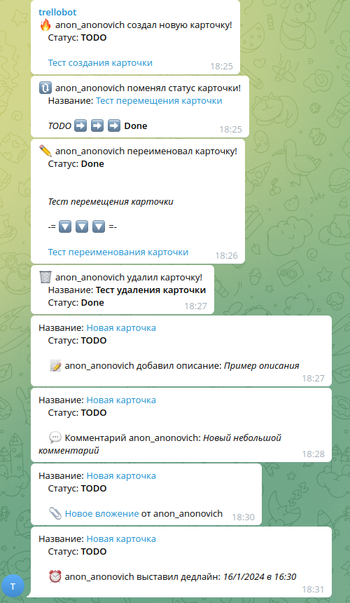
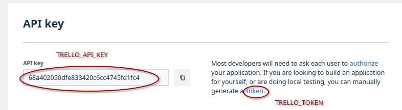
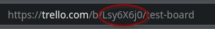

# Trellobot

Trellobot - это телеграм бот для отслеживания изменений на Trello доске.

## Отображаемые действия с карточками

- Создание
- Изменение статуса
- Переименование
- Удаление
- Изменение описания
- Новый комментарий
- Добавление вложения
- Изменение даты дедлайна

## Конфигурация
Все изменения конфигурации должны производиться путём изменения ``.env``
Шаблон можно найти в файле [.env.example](https://github.com/AivenGog/trellobot/blob/master/.env.example ".env.example") (не забудьте переименовать на ``.env``)
### Переменные power-up на Trello
- На [странице создания](https://trello.com/power-ups/admin/new) power-up в графе *Iframe connector* введите:
    > https://glitch.com/edit/#!/trello-power-up-skeleton

    Заполните другие поля, выберите Workspace вашей доски.

- Сгенерируйте API ключ во вкладке API key вашего power-up

- Запишите ``TRELLO_API_KEY`` и перейдите по ссылке Token, откуда получите ``TRELLO_TOKEN``.
    

### Получение других переменных

- Получите ``TELEGRAM_BOT_TOKEN`` у [@BotFather](t.me/BotFather)
- Для получения ``TRELLO_BOARD_ID`` скопируйте короткий код из ссылки на вашу доску
    
- Получите ``СHAT_ID`` группы, куда будут присылаться сообщения, с помощью неофициальных клиентов телеграм или добавьте бота в группу, напишите любую /комманду и возьмите значение ["message"]["chat"]["id"] из JSON полученного из запроса к https://api.telegram.org/bot{TELEGRAM_BOT_TOKEN}/getUpdates . ID должен быть отрицательным целым числом.
- Укажите в ``WEBHOOK_URL`` и ``PORT`` адрес и порт сервера, который будет принимать запросы от вебхука. Не забудьте открыть порт в файрволе и сделать их видимыми в глобальной сети.


### Создание вебхука
После того, как вы заполнили все переменные в config.py и открыли доступ к машине извне, вам предстоит создать вебхук на Trello.

Сперва запустите trellobot.py и оставьте его работать, затем в отдельном терминале запустите ``webhook_generate.py``. В случае, если к токену не будет привязано никаких других вебхуков и всё пройдёт успешно, в терминале выведется соответствующее сообщение. 

Если в группу телеграм приходит несколько одинаковых сообщений, или вы поменяли адресс сервера, то запустите ``delete_all_webhooks.py`` а затем повторите процедуру создания вебхука.

## Запуск (вручную)
Скачайте репозиторий
```bash
git clone https://github.com/AivenGog/trellobot.git && cd trellobot
```

Создайте виртуальное окружение:
```bash
python3 -m venv venv
source venv/bin/activate 
```

Установите необходимые библиотеки и их зависимости

```bash
pip install -r requirements.txt
```

Внесите все необходимые данные в config.py и запустите trellobot.py

```bash
python3 trellobot.py
```
Если программа работает и реагирует на изменения на доске без ошибок, то вы можете запустить её в фоне.

```bash
chmod +x trellobot.py
nohup python3 trellobot.py &
```
## Запуск (Docker)
Соберите образ докер контейнера.

Скачайте репозиторий
```bash
git clone https://github.com/AivenGog/trellobot.git && cd trellobot
```

```bash
docker build -t trellobot . 
```
Запустите контейнер.

```bash
docker run \
   --name trellobot \
   --restart=unless-stopped \
   -d -p $PORT:$PORT \
   --env-file .env
   trellobot:latest
```
Вы можете посмотреть логи через такую команду. Флаг --follow будет автоматически обновлять вывод.
```
docker logs --follow  trellobot
```

Также вы можете забрать переменные напрямую из окружения с помощью такой команды. Вы можете указать каждую переменную напрямую в параметре запуска через ``=``:
```bash
docker run \
    --name trellobot \
    --restart=unless-stopped \
    -d -p $PORT:$PORT \
    -e TELEGRAM_BOT_TOKEN \
    -e CHAT_ID \
    -e TRELLO_API_KEY \
    -e TRELLO_TOKEN \
    -e TRELLO_BOARD_ID \
    -e WEBHOOK_URL \
    -e PORT \
    -e LOGGING_LEVEL \
    trellobot:latest
```

## License

[Unlicense](https://choosealicense.com/licenses/unlicense/#/)
